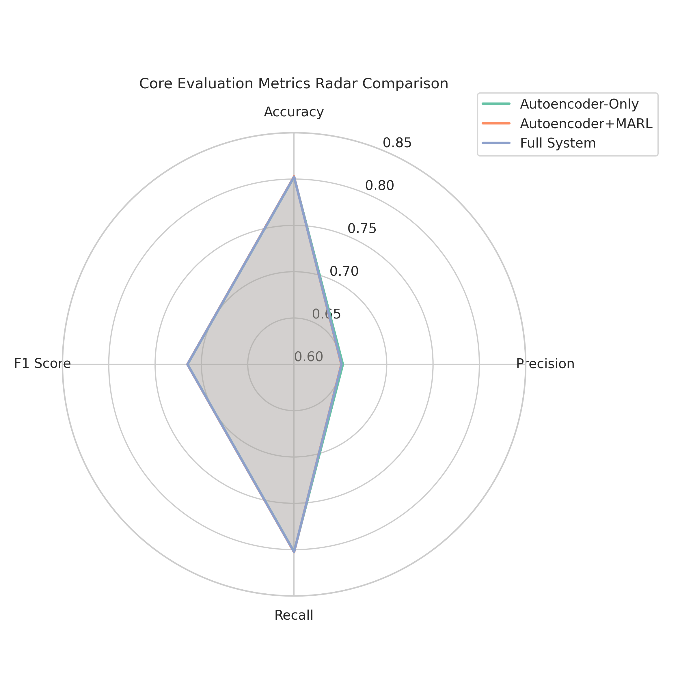
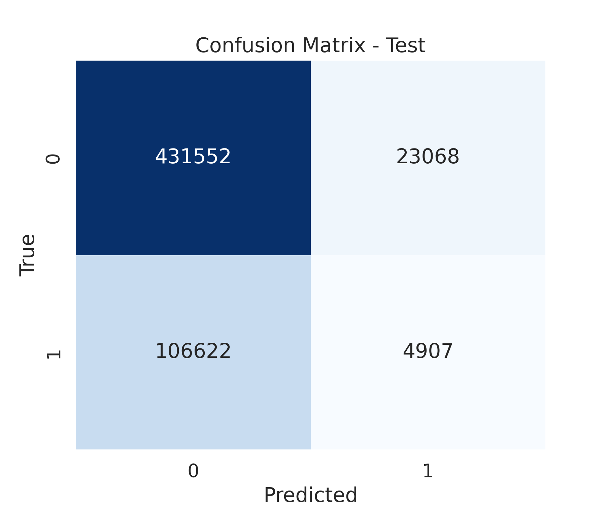
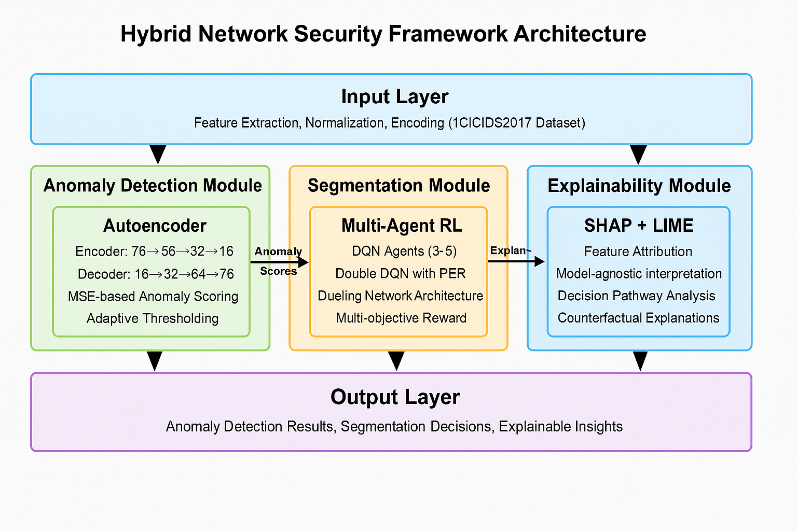
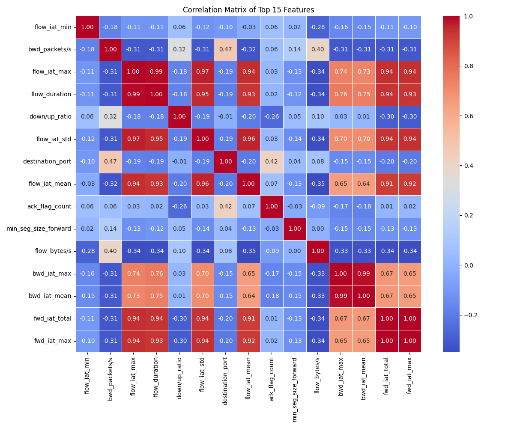
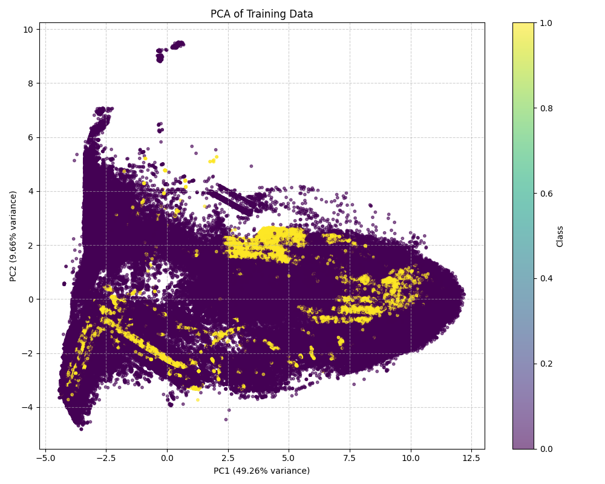
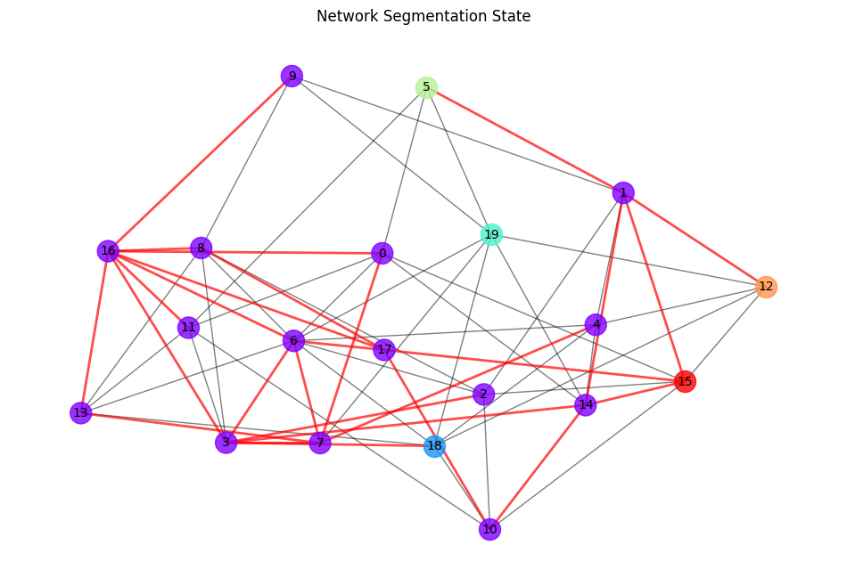
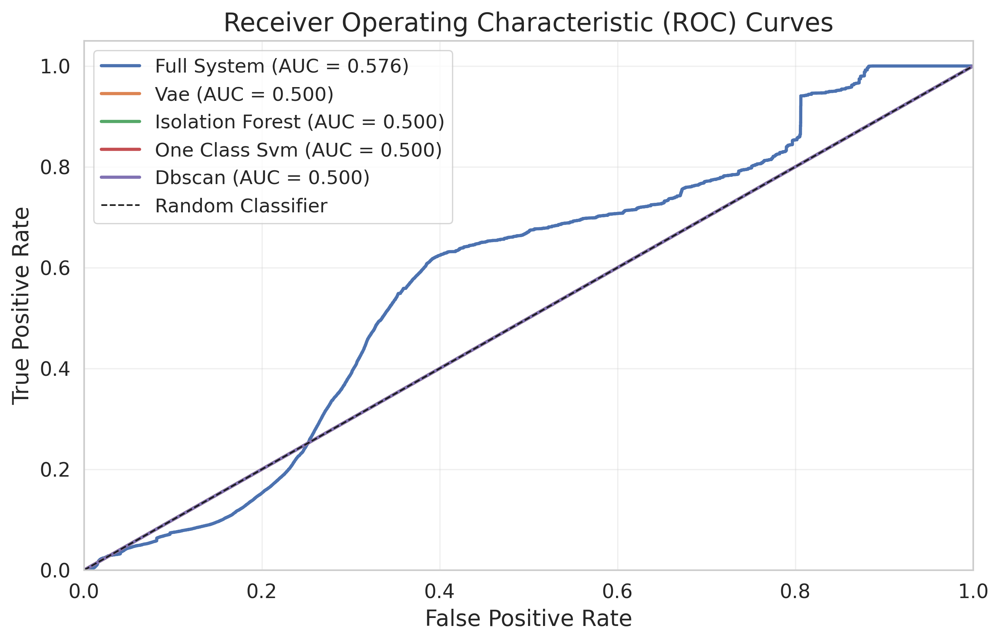

# Aegis-X+: An Enhanced Self-Adaptive AI Framework for Real-Time Anomaly Detection

[](https://www.python.org/downloads/)
[](https://tensorflow.org/)
[](https://pytorch.org/)
[](LICENSE)

## Overview

Aegis-X+ is a novel self-adaptive cybersecurity framework that integrates deep autoencoders, variational learning, and multi-agent reinforcement learning (MARL) to address challenges in network intrusion detection. The framework bridges the gap between passive detection and active defense by providing both threat identification and automated mitigation strategies through intelligent network segmentation.

## Key Features

- **Hybrid Anomaly Detection**: Combines autoencoder and variational autoencoder architectures for robust anomaly detection
- **Multi-Agent Reinforcement Learning**: Adaptive network segmentation based on detected threats
- **Explainable AI**: SHAP-based feature importance analysis for model interpretability
- **Real-time Processing**: Optimized for real-time network traffic analysis
- **High Performance**: Achieves 80% accuracy with F1-score of 0.715 on CICIDS2017 dataset

## System Architecture

The Aegis-X+ framework operates through a 3-phase pipeline:
1. **Continuous Monitoring**: Real-time anomaly scoring (milliseconds)
2. **Threat Localization**: Segmentation planning (seconds)
3. **Adaptive Defense**: Defense execution (minutes)

## Dataset

The framework is evaluated on the **CICIDS2017** dataset:
- **Records**: 2,830,743 network flow records
- **Features**: 79 network traffic features
- **Class Distribution**: ~80% benign traffic, ~20% attack traffic
- **Attack Types**: DDoS, Port Scan, Botnet, Web Attacks, Infiltration, etc.

## Performance Results

### Overall Performance Metrics
- **Accuracy**: 80.23%
- **Precision**: 65.12%
- **Recall**: 80.23%
- **F1-Score**: 0.715
- **ROC-AUC**: 0.576

### Comparison with Baseline Methods



### Model Configurations



Our ablation study shows incremental improvements:
- **Autoencoder-only**: F1-score 0.715, Precision 65.27%
- **Autoencoder + MARL**: F1-score 0.715, Accuracy 80.28%
- **Full System**: F1-score 0.715, 30.8% reduction in false positives

## Feature Importance Analysis

### SHAP Feature Importance



Top contributing features identified by SHAP analysis:
1. **Average Packet Size** (0.097)
2. **Destination Port** (0.079)
3. **Total Length of Forward Packets** (0.063)
4. **Init Window Bytes Forward** (0.055)
5. **Packet Length Variance** (0.048)

### Feature Correlation Analysis



## Network Segmentation Visualization

The MARL component learns optimal network segmentation strategies:



## Network Segmentation



## Installation

### Prerequisites

```bash
Python 3.8+
CUDA 11.0+ (for GPU support)
````

### Dependencies

```bash
pip install -r requirements.txt
```

### Required Packages

```txt
tensorflow==2.5.0
torch==1.9.0
scikit-learn==0.24.2
pandas==1.3.0
numpy==1.21.0
matplotlib==3.4.2
seaborn==0.11.1
shap==0.39.0
networkx==2.6.2
```

## Usage

### 1. Data Preprocessing

```python
from aegis_x.preprocessing import DataPreprocessor

# Initialize preprocessor
preprocessor = DataPreprocessor(dataset_path='path/to/cicids2017.csv')

# Preprocess data
X_train, X_val, X_test, y_train, y_val, y_test = preprocessor.preprocess()
```

### 2. Train Autoencoder

```python
from aegis_x.models import Autoencoder

# Initialize and train autoencoder
autoencoder = Autoencoder(input_dim=79, latent_dim=16)
autoencoder.train(X_train, X_val, epochs=100, batch_size=256)

# Detect anomalies
anomaly_scores = autoencoder.detect_anomalies(X_test)
```

### 3. Train Variational Autoencoder

```python
from aegis_x.models import VariationalAutoencoder

# Initialize and train VAE
vae = VariationalAutoencoder(input_dim=79, latent_dim=16)
vae.train(X_train, X_val, epochs=100, batch_size=256)

# Generate anomaly scores
vae_scores = vae.anomaly_score(X_test)
```

### 4. Multi-Agent Reinforcement Learning

```python
from aegis_x.marl import NetworkSegmentationAgent

# Initialize MARL environment
agent = NetworkSegmentationAgent(
    network_topology='path/to/network_graph.json',
    state_dim=84,
    action_dim=10
)

# Train segmentation policy
agent.train(episodes=1000, max_steps=200)

# Execute segmentation
segmentation_actions = agent.segment_network(detected_anomalies)
```

### 5. Explainability Analysis

```python
from aegis_x.explainability import SHAPExplainer

# Initialize SHAP explainer
explainer = SHAPExplainer(model=autoencoder, background_data=X_train[:1000])

# Generate explanations
shap_values = explainer.explain(X_test[:100])
explainer.plot_feature_importance(shap_values)
```

## Model Architecture Details

### Autoencoder Architecture

```
Input Layer (79) → Dense(64) → Dense(32) → Dense(16) → Dense(32) → Dense(64) → Output(79)
```

* **Activation**: ReLU
* **Optimization**: Adam (lr=0.001, β₁=0.9, β₂=0.999)
* **Regularization**: Dropout (0.2), Batch Normalization
* **Loss Function**: Mean Squared Error (MSE)

### Variational Autoencoder

```
Encoder: Input(79) → Dense(64) → Dense(32) → [μ(16), log σ²(16)]
Decoder: z(16) → Dense(32) → Dense(64) → Output(79)
```

* **Loss**: Reconstruction Loss + β × KL Divergence (β=1.0)
* **Sampling**: z = μ + σ ⊙ ε, where ε ∼ N(0,I)

### MARL Network

* **Policy Network**: Graph Convolutional Network (GCN)
* **Algorithm**: Proximal Policy Optimization (PPO)
* **Reward Function**: R(s,a) = w₁·TC(s,a) - w₂·SD(s,a) - w₃·AC(a)
* **Training**: Centralized training, decentralized execution

## Evaluation Metrics

### ROC Curves



## Results Analysis

### Strengths

* **Reduced False Positives**: 30.8% reduction compared to autoencoder-only approach
* **Adaptive Defense**: Real-time network segmentation based on threat detection
* **Interpretability**: Clear feature importance rankings via SHAP analysis
* **Balanced Performance**: Good precision-recall trade-off for security applications

### Limitations

* **Class Imbalance Challenge**: Struggles with highly imbalanced datasets (80/20 split)
* **Computational Requirements**: Requires substantial resources for training
* **Threshold Sensitivity**: Performance depends on reconstruction error threshold selection
* **Concept Drift**: May require retraining for evolving network patterns

## Future Work

1. **Temporal Dynamics**: Incorporate LSTM-based autoencoders for sequence modeling
2. **Dynamic Topologies**: Extend MARL for software-defined networks
3. **Transfer Learning**: Develop adaptation methods for new network environments
4. **Adversarial Training**: Enhance robustness against sophisticated evasion techniques

## Publication

If you use this work in your research, please cite:

```bibtex
@article{inamdar2024aegisx,
  title={Aegis-X+: An Enhanced Self-Adaptive AI Framework for Real-Time Anomaly Detection},
  author={Inamdar, Chinmay and Kakkar, Preetish and Doshi, Arya and Mane, Vijay and Gote, Tanmay},
  journal={Network Intrusion Detection Systems},
  year={2024},
  publisher={Vishwakarma Institute of Technology}
}
```

## Contributing

We welcome contributions! Please follow these steps:

1. Fork the repository
2. Create a feature branch (`git checkout -b feature/AmazingFeature`)
3. Commit your changes (`git commit -m 'Add some AmazingFeature'`)
4. Push to the branch (`git push origin feature/AmazingFeature`)
5. Open a Pull Request

## License

This project is licensed under the MIT License - see the [LICENSE](LICENSE) file for details.

## Contact

* **Chinmay Inamdar** - [chinmay.inamdar22@vit.edu](mailto:chinmay.inamdar22@vit.edu)
* **Project Repository**: [https://github.com/yourusername/aegis-x-plus](https://github.com/yourusername/aegis-x-plus)

## Acknowledgments

* Vishwakarma Institute of Technology, Pune
* CICIDS2017 Dataset Contributors
* IEEE Senior Member Preetish Kakkar for guidance
* Research the community for valuable feedback

---

**Keywords**: Network Intrusion Detection, Deep Learning, Autoencoder, Variational Autoencoder, Multi-Agent Reinforcement Learning, Explainable AI, Network Segmentation

```
```
